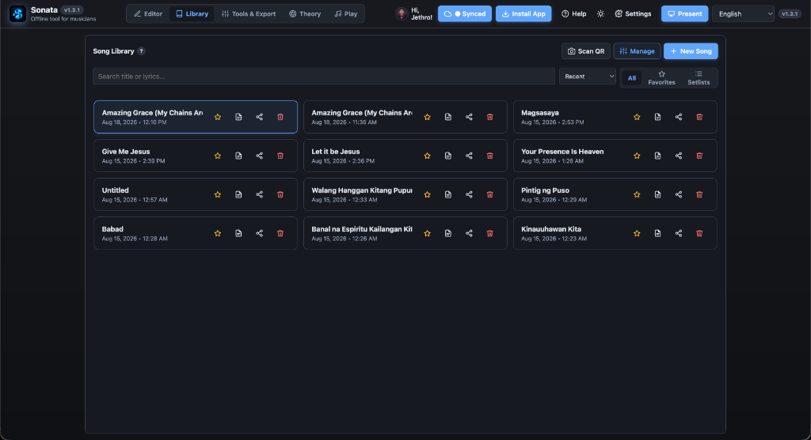
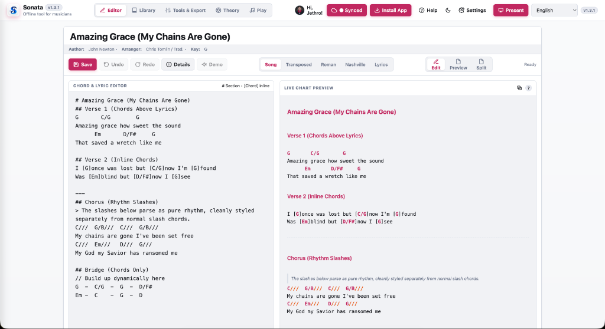
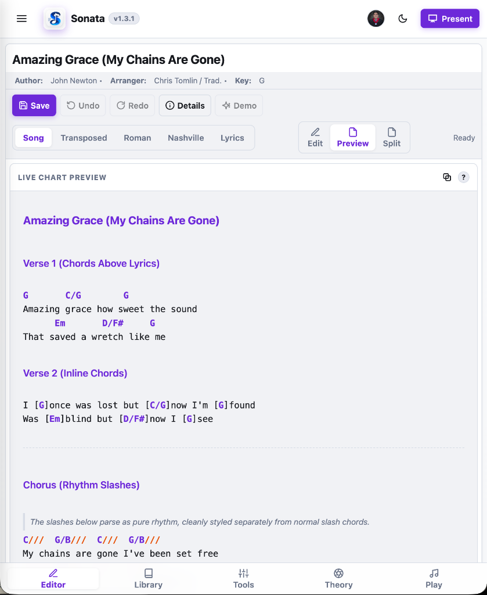
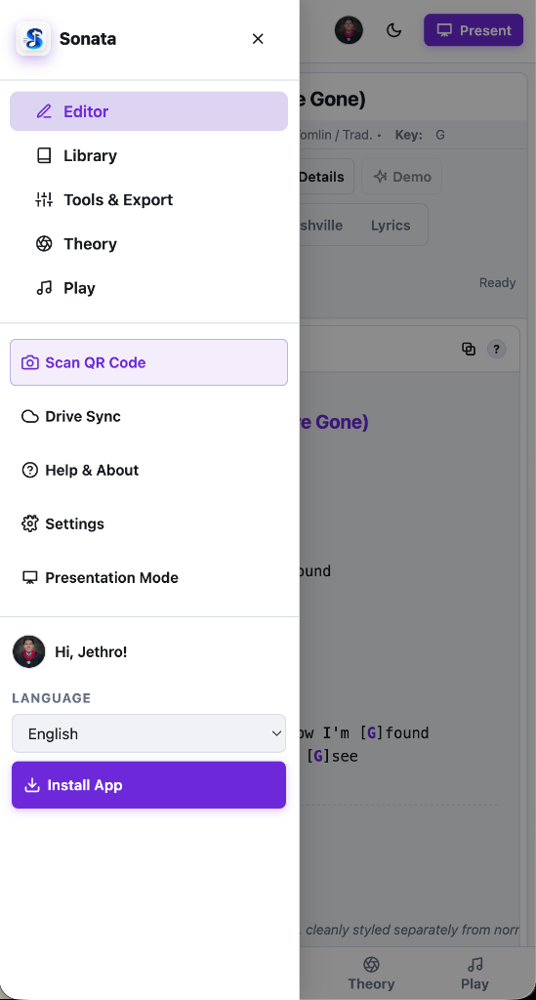
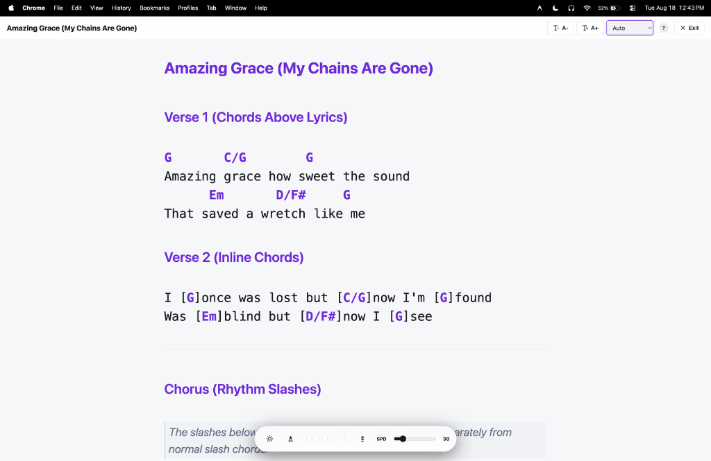

# Sonata 🎵

> **The modern, distraction-free chord chart editor and musical toolkit for musicians, bands, and worship teams.**

[](https://jethfrane-sonata.vercel.app)

[](#)
[](#)

---

## 🌐 Live Web App

* **Production URL:** [https://jethfrane-sonata.vercel.app](https://jethfrane-sonata.vercel.app)


Sonata runs entirely in your web browser. No software installation or user accounts are required—simply open the link and start playing.

---

## 📸 Interface Showcase

| 📝 Split Editor (Light Mode) | 🎹 Virtual Piano, Fretboard & Tuner |
| :---: | :---: |
|  |  |

| 📚 Song Library (Dark Mode) | 🎨 Custom Themes & Accents |
| :---: | :---: |
|  |  |

| 📱 Mobile-First Live Preview | 📑 Slide-Out Drawer Navigation | 🎭 Stage Presentation Mode |
| :---: | :---: | :---: |
|  |  |  |

---

## 🌟 Overview

Created by **Jeth Frane**, Sonata was built to replace clumsy paper binders, cluttered PDF viewers, and paid subscription chart apps. It combines a fast, intuitive chord sheet markdown editor with interactive musical tools, instant team sharing, and stage-ready presentation modes.

### Why Musicians Love Sonata:
* 🆓 **100% Free Forever:** No paywalls, trial periods, or monthly subscriptions.
* 🔒 **Private & Decentralized:** Your song charts belong to you. Data is stored on your device and backed up to your personal Google Drive. No centralized databases or user tracking.
* ⚡ **Stage-Ready:** Distraction-free fullscreen presentation mode with smooth auto-scroll, customizable metronome, and true-black stage theme.
* 🤖 **AI Co‑Writer Built-in:** Real‑time music suggestions, chord generation, and UI automation (change keys, themes, and tempo) directly via chat. Uses a mixed Bring-Your-Own-Key (BYOK) approach to ensure unlimited free usage while providing a seamless fallback.
* 📱 **Universal Responsiveness:** Designed for all screens—smartphones, iPads, tablets, laptops, and wide desktop displays.

---

## 🚀 Key Features

### 1. 📝 Chord & Lyric Editor
* **Dual Format Support:** Works with both traditional chord lines (`G  C/G  D`) and inline bracket chords (`[G]Amazing [C]grace`).
* **Clean Markdown Syntax:**
  * `# Title` – Sets song title
  * `## Section` – Creates section headers (`Verse 1`, `Chorus`, `Bridge`)
  * `---` – Inserts a clean visual divider
  * `> Note` or `// Comment` – Adds rehearsal notes that never transpose accidentally
* **Live Transposition & Capo:** Transpose semitones up/down instantly with automatic enharmonic spelling (Flats/Sharps toggle) and capo calculations.
* **Notation Formats:** Switch between Standard Chords, Roman Numeral Analysis, and Nashville Number System.
* **Undo & Redo History:** 50-step history stack with standard keyboard shortcuts (`Ctrl+Z` / `Ctrl+Y`).

### 2. 📚 Song Library & Setlist Manager
* **Fast Search & Filtering:** Filter by song key, artist, or tags with instant search.
* **Multi-Song Setlists:** Create custom worship sets and gig setlists. Cycle through songs with one click or arrow keys on stage.
* **Quick Import & Export:** Export your entire song library as JSON backups and restore on any device.

### 3. 🎹 Music Theory & Interactive Tools
* **Interactive Circle of Fifths:** Click any key to hear 3-note harmonic audio synthesis. Toggle auto-rotate and highlight diatonic key families in real time.
* **Virtual Piano Keyboard:** Multi-octave digital piano with sustain release and scale chord highlighting.
* **Interactive Fretboards:** Visualization for 6-String Guitar, 4-String Bass, 5-String Bass, and Ukulele.
* **Digital Chromatic Tuner & Pitch Reference:** Built-in microphone tuner with visual pitch cents needle and audio tone generator.
* **Visual & Audio Metronome:** Tap tempo, adjustable BPM (30–280), custom time signatures (2/4, 3/4, 4/4, 6/8), and flashing beat dots.

### 4. 🎭 Stage Presentation Mode
* **Immersive Fullscreen:** Strips away distractions for maximum legibility on music stands.
* **Hands-Free Auto-Scroll:** Adjustable smooth scrolling with variable speed controls.
* **Stage Display Themes:** Switch between High-Contrast Light, Studio Dark, and OLED Stage True-Black.

### 5. 📤 Zero-Friction Sharing & Exports
* **Scannable QR Codes:** Share songs directly between band members' phones via dynamic QR codes.
* **Compressed Share Links:** Generate compact direct links containing full song charts without requiring an account.
* **Multi-Column Vector PDF & PNG:** Export beautifully formatted printable sheets with your team's custom logo.

### 6. ☁️ Google Drive Cloud Backup
* **Direct Cloud Sync:** Automatically syncs your library file (`sonata_library.json`) to your personal Google Drive in the background.

---

## 🛠️ Technology Stack

* **Frontend Architecture:** Vanilla HTML5, Modern CSS3 (Glassmorphism, CSS Grid, Flexbox), Vanilla ES6+ JavaScript.
* **Audio Synthesis:** Web Audio API (polyphonic synth, resonant filters, sample-accurate metronome scheduling).
* **PDF & Graphics:** html2pdf.js, QRCode.js, SVG Icons.
* **Hosting & CI/CD:** [Vercel](https://vercel.com) (Edge CDN, Serverless AI Backend, Automated Deployments).

## 📦 Update Log
- **2026-08-26**: Updated AI backend to Gemini 3.6‑Flash model.
- **2026-08-26**: Improved 429 handling to surface billing depletion messages.
- **2026-08-26**: Adjusted mobile FAB position to avoid overlap on small screens.
- **2026-08-26**: Added Open Graph metadata for link previews.
- **2026-08-26**: Added AI Co‑Writer bullet to README.


---

## 💻 Local Development

Run Sonata locally without any complex build tools or dependencies:

1. **Clone the repository:**
   ```bash
   git clone https://github.com/jethfrane/Sonata.git
   cd Sonata
   ```

2. **Serve locally:**
   You can use any static local server (e.g. Python or VS Code Live Server):
   ```bash
   python3 -m http.server 8000
   ```
   Open `http://localhost:8000` in your browser.

3. **Bundle for single-file distribution (Optional):**
   ```bash
   python3 bundle.py
   ```

---

## 🔒 Privacy & Security

* **Zero Centralized Database:** Sonata does not store or process your songs on external company servers.
* **Isolated Google OAuth 2.0:** Uses the restricted `drive.file` scope—Sonata can only access the files it creates in your Google Drive and cannot read any other personal documents.
* **No Telemetry / No Trackers:** 100% private, open, and client-side.

---

## 👤 Author & License

Developed with ❤️ by **[Jeth Frane](https://github.com/jethfrane)**.

Released under the **MIT License** — free for personal, church, educational, and commercial use.
