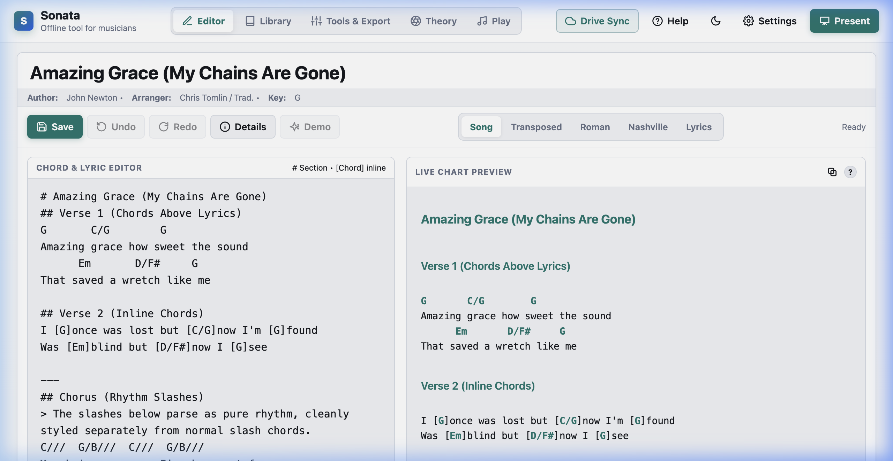
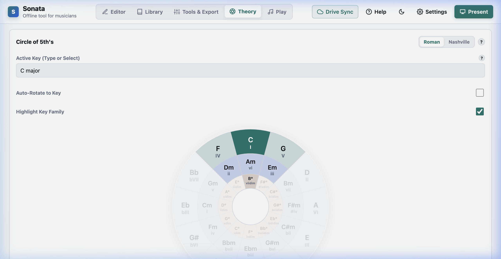
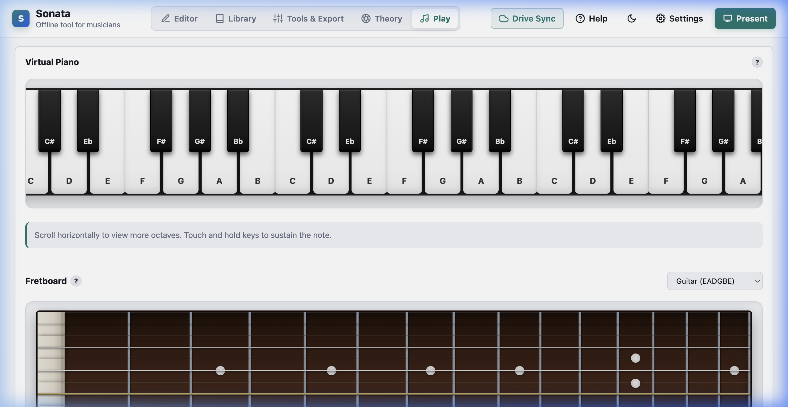

# Sonata Master 🎵

Sonata is a professional, offline-first, mobile-friendly chord sheet editor and music toolkit designed specifically for musicians, worship leaders, and bands. It runs entirely in the browser with no backend servers, no sign-ups, and no databases required.

The entire application lives in a single, lightning-fast static file (`index.html`) optimized for GitHub Pages and offline stage use.

## 📸 Screenshots & Walkthrough

| 📝 Chord Sheet Editor | ⚙️ Music Theory (Circle of 5ths) | 🎹 Virtual Instruments |
| :---: | :---: | :---: |
|  |  |  |

## 🌟 Why Sonata Was Built

Sonata was created by Jeth Frane primarily to help church musicians and bands collaborate and stay synchronized during rehearsals and live services.

Preparing for a setlist often involves juggling scattered text files, unformatted lyric sheets, and manual transposition under pressure. Sonata eliminates this friction by centralizing all your tools into one distraction-free web app:

1. **Band Sync & Team Collaboration:** Share full, interactive song charts instantly via scannable QR codes or ultra-compressed links without needing user accounts.
2. **Centralized Preparation:** Put away the calculator and separate theory apps—transposition, metronomes, key detection, chord calculators, and instrument references are built directly into your editor view.
3. **Stage-Ready Presentation:** A high-contrast presentation mode with auto-scroll and independent stage themes keeps your eyes on the music, not the software.
4. **Offline Resilience:** Works completely offline in venues with zero Wi-Fi or cellular coverage.
5. **Universal Formatting:** Paste any standard chord chart, and Sonata preserves your spacing while instantly converting it into Roman Numerals, Nashville Numbers, or Lyrics-Only sheets.

## 🚀 Core Features & Capabilities

### 1. Advanced Song Editor
* **Chord Over Lyrics & Inline Chords:** Seamlessly handles traditional spacing (`G C/G G`) and bracketed inline chords (`[G]Amazing [C]grace`).
* **Rich Markdown Support:** Use `# Header` for large titles, `## Subheader` for sections, `---` for clean dividers, and `> Note` or `// Comment` for notes that will never accidentally transpose.
* **Metadata & References:** Store your Song Title, Artist, Arranger/Creator, and multiple named Reference Links (such as YouTube tutorial links).
* **Multi-Step Undo/Redo:** Full undo/redo history stack (up to 50 levels) with keyboard shortcuts (`Ctrl+Z` / `Ctrl+Y`). Never lose an edit again.
* **Smart Text Wrapping:** Long chord lines wrap cleanly inside the editor instead of overflowing horizontally.
* **Live Metadata Bar:** Author, Arranger, and detected Key are displayed in a compact bar below the title—always visible without opening dialogs.
* **Demo Safeguards:** The Demo button is automatically disabled when the editor has content, with confirmation prompts to prevent accidental overwrites.
* **Split Live Chart Editor:** A responsive split-pane layout for desktop screens that allows editing on one side and viewing live-rendered output on the other, maximizing work area proportions.
* **Tactile Feedback & Action Toasts:** Native-feeling tactile feedback vibration (when supported) and visual action toast notifications for copy, save, share, and undo/redo operations.

### 2. Music Theory & Instruments Engine
* **Interactive Circle of 5th's:** Click any key to hear a 3-note synthesized chord. Toggle "Auto-Rotate" to spin your active key to the top, and toggle "Highlight Key Family" to dim non-diatonic chords and reveal the 7 chords belonging to your key. Intelligently swaps to relative minor layouts when a minor key is active. Diminished and minor chords are configured to respect proper flat/sharp music theory spelling rules based on the selected key family, and the chords ring out naturally without abrupt audio stops.
* **Multi-Format Conversions:** Instantly view your sheet as Transposed Chords, Roman Numerals (`I, ii, iii`), Nashville Numbers (`1, 2, 3`), or Lyrics Only (stripping out all chords for clean vocal sheets).
* **Virtual Instruments & High-Quality Synthesis:** Includes a scrollable multi-touch Digital Piano and an interactive Fretboard supporting 6-String Guitar, 4-String Bass, 5-String Bass, and Ukulele. Features high-quality acoustic piano and guitar chord synthesis.
* **True Instrument Proportions:** Built with realistic guitar/bass fretboard tapering, correct string gauges, and wide virtual piano keys for an intuitive playing and learning experience.
* **Capo Support:** Set your Capo fret, and Sonata instantly calculates the actual chord shapes you need to play while keeping your original key intact.

### 3. Stage Presentation Mode
* **Immersive Fullscreen:** Strips away all editor chrome for a clean, distraction-free stage view.
* **Isolated Stage Themes:** Switch between Light, Dark, and Stage (True Black) themes independently from your main editor background.
* **Built-in Auto-Scroll & Metronome:** Control auto-scroll speed on the fly with floating controls that fade out when idle.

### 4. Library Management & Batch Operations
* **Sort Library:** Sort your song list by Title, Author, Arranger, Key, or Recent—with contextual metadata shown on each card.
* **Manage Library View:** A full-screen table view of all songs with search, select-all checkboxes, and bulk actions.
* **Batch Delete & Share:** Select multiple songs and delete or share them as a setlist in one click.

### 5. Zero-Friction Sharing & QR Codes
* **Intelligent Short Links:** Short URLs via `is.gd` for small payloads; for large setlists (4+ songs), compressed data is stored on `dpaste.com` and retrieved via a minimal `?paste=ID` parameter—always scannable.
* **Shared Link Preview:** An interactive preview modal that allows users to review shared songs or setlists before importing them into their local library.
* **Theme-Aware QR Cards:** QR Profile Card images use your active accent color, display song metadata (Key, BPM, artist), and song lists for setlists—no raw URLs cluttering the image.
* **Native & Social Sharing:** Share via device share sheet, WhatsApp, Facebook, X, Email, or copy link.
* **View-Only Import:** Shared links open in read-only preview without affecting the recipient's library.

### 6. Professional Export System
* **Multi-Column Layouts:** Export in 1, 2, or 3-column layouts with intelligent word & bracket wrapping.
* **Theme-Aligned Colors:** Exported PNG and PDF files inherit your active accent color for headers, chords, and inline chord brackets—matching your UI theme exactly.
* **Multiple Formats:** Export as vector PDF, high-resolution PNG, plain text TXT, or direct browser Print with full metadata headers and page footers.

### 7. Cloud Backup & Sync (Optional)
* **Google Drive Sync:** Back up and restore your library via Google Identity Services and the Drive REST API (`drive.file` scope). Changes auto-merge by timestamp and sync to your private Google Drive, keeping data consistent across all devices. Direct fetch requests are used for a lightweight integration without heavy external client library dependencies.

## 🛠️ How to Publish on GitHub Pages

Because Sonata is a single-file static app, publishing it takes less than 60 seconds:

1. Create a new repository on GitHub (e.g., `sonata-master`).
2. Save the final code provided into a file named exactly `index.html`.
3. Upload `index.html` to the root of your repository.
4. Go to your repository **Settings > Pages**.
5. Under **Build and deployment**, set the Branch to `main` (or `master`) and `/ (root)` folder, then click **Save**.
6. Your app will be live globally at `https://<your-username>.github.io/<repository-name>/`!

## 📦 Data Privacy & Backup

Sonata stores all songs and settings securely in your browser's `localStorage` and optionally syncs with Google Drive's private app folder. Your data never leaves your device or your personal storage. To back up your library manually, simply go to Settings and click **Export Backup (.json)**. You can restore it anytime using **Import Backup**.

Created with ❤️ by Jeth Frane for musicians everywhere.
